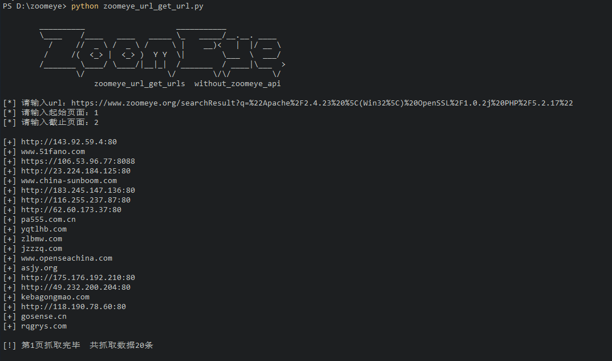
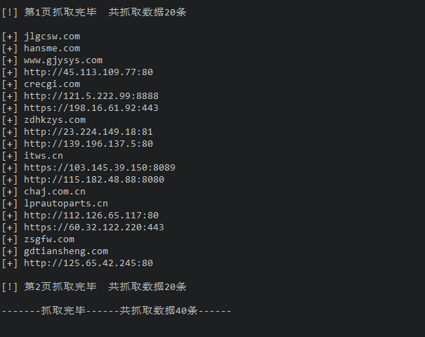

# zoomeye_url_get_urls_without_api

1.0.3

升级域名添加http协议

--------------------------------

1.0.2

升级报错，并且报错后跳过执行，程序不退出。

------------------------------

改良了zoomeye_get_urls_without_api

做一个小升级。

修改：

1.因为1.0.0版本存在url编码与zoomeye有时候不一致导致搜索不成功的情况，所以这个版本采用直接复制zoomeye地址栏中地址，再重新编码后采集结果的方法。

2.优化数据采集方式，1.0.0版本采集ip:prot形式数据没有问题，域名有时候会出错。这个版本进行了优化。

useage: python3 zoomeye_url_get_urls_without_api.py

zoomeye注册自带10000条api数据可拉取，但很快就被挥霍完了。所以，急需这个不需要api拉取数据的东东。

使用方法很简单：zoomeye_url_get_urls_without_api.py

然后输入要查询的url，再输入拉取数据的起始页面和截止页面。

ok了

目前存在的bug：

测试还不够多，自己用了几次，感觉还可以。

如果发现问题，欢迎issues。

当然，如果你觉得好用，别忘了给我买杯咖啡。

